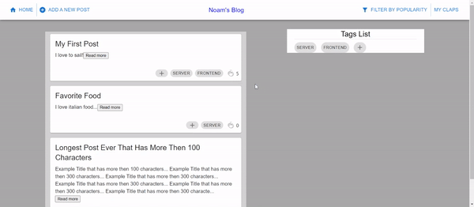

<h1 align="center">Noam Regev</h1>
<h3 align="center">Computer Science Student at The Hebrew University of Jerusalem</h3>
 
<h4 align="center"> 👨‍💻 All of my projects are available at https://regevnoam1.github.io/Portfolio/ </h4>

 

<!--  -->

 
<h3 align="center">Connect with me on linkedin:</h3>

 

<h2> </h2>

<h3 align="center">Stack:</h3>

    &nbsp;
    &nbsp;
    &nbsp;
    &nbsp;
    &nbsp;
    &nbsp;
    &nbsp;
    &nbsp;
    &nbsp;

<h2> </h2>

   

<h2 align="center"> Some of my projects: </h2>
 

   &nbsp&nbsp&nbsp&nbsp
 

   &nbsp&nbsp&nbsp&nbsp
 

   &nbsp&nbsp&nbsp&nbsp
 

   
